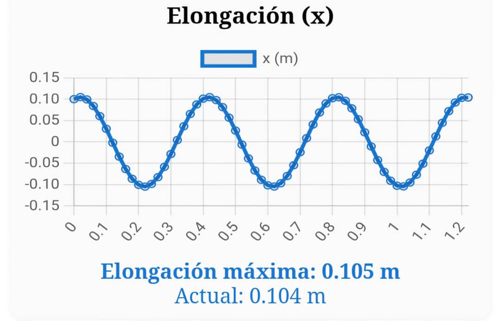
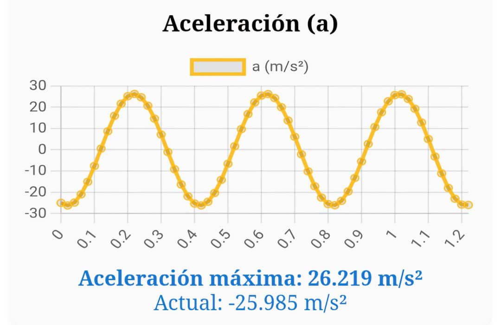

# ⚙️ Simulación de Sistema Oscilatorio

Este proyecto es un simulador web interactivo de un **oscilador armónico simple** (masa y resorte), desarrollado en HTML, CSS y JavaScript. Permite visualizar y analizar el comportamiento físico del sistema, modificar parámetros y observar la evolución de las variables principales en tiempo real.

---

## 📚 ¿Qué es un oscilador armónico simple?

Un oscilador armónico simple es un sistema físico formado por una masa conectada a un resorte ideal. Cuando la masa se separa de su posición de equilibrio, el resorte ejerce una fuerza restauradora proporcional a la elongación, generando un movimiento oscilatorio periódico. Este tipo de movimiento es fundamental en la física y aparece en muchos sistemas naturales y tecnológicos.

### 📐 **Fórmulas utilizadas**

- **Elongación:**  
  `x(t) = x₀ cos(ωt) + (v₀/ω) sin(ωt)`  
  *Posición de la masa respecto al equilibrio en función del tiempo.*

- **Velocidad:**  
  `v(t) = -x₀ ω sin(ωt) + v₀ cos(ωt)`  
  *Rapidez y dirección del movimiento en cada instante.*

- **Aceleración:**  
  `a(t) = -k/m · x(t)`  
  *Proporcional y opuesta a la elongación, según la ley de Hooke.*

- **Fuerza:**  
  `F(t) = -k · x(t)`  
  *Fuerza restauradora ejercida por el resorte.*

- **Energía cinética:**  
  `E_c(t) = ½ m v(t)²`  
  *Energía asociada al movimiento de la masa.*

- **Energía potencial:**  
  `E_p(t) = ½ k x(t)²`  
  *Energía almacenada en el resorte por la deformación.*

- **Energía total:**  
  `E_t = ½ m v₀² + ½ k x₀²` (constante)  
  *La suma de la energía cinética y potencial permanece constante (sin fricción).*

- **Frecuencia angular:**  
  `ω = √(k/m)`  
  *Determina la rapidez de las oscilaciones, depende de la masa y la rigidez del resorte.*

- **Fase inicial:**  
  `φ = atan2(-v₀/(x₀·ω), 1)`  
  *Indica el estado inicial del movimiento en el ciclo de la oscilación.*

---

## ✨ Características del simulador

  
- 📊 **Gráficos dinámicos** de elongación, velocidad, aceleración, fuerza y energía total usando Chart.js.
- 🎛️ **Controles interactivos** para ajustar masa, constante del resorte, elongación inicial y velocidad inicial.
- ▶️⏸️🔄 **Botones** para iniciar, pausar y reiniciar la simulación.
- 🌞🌚 **Modo claro/oscuro** con selector deslizante (sol/luna) para mejor visualización.
- 📱 **Visualización responsiva**: se adapta a computadoras y teléfonos.
- 🧑‍🔬 **Explicación física** y fórmulas en la interfaz para facilitar el aprendizaje.
- 📈 **Valores máximos y actuales** mostrados debajo de cada gráfico para análisis rápido.

---

## 🕹️ ¿Cómo usar el simulador?

1. **Ajusta los parámetros físicos** (masa, constante del resorte, elongación y velocidad inicial) en los controles superiores.
2. **Inicia la simulación** con el botón "Iniciar". Puedes pausar o reiniciar en cualquier momento.
3. **Observa los gráficos** para ver cómo evolucionan las variables físicas y energías del sistema.
4. **Cambia el modo claro/oscuro** usando el selector deslizante en la parte superior derecha.
5. **Analiza los valores máximos y actuales** que aparecen debajo de cada gráfico.

---

## 🛠️ Tecnologías utilizadas

  
- 📝 **HTML5**
- 🎨 **CSS3** (diseño responsivo y modo oscuro)
- 💻 **JavaScript**
- 📊 **[Chart.js](https://www.chartjs.org/)** (gráficos interactivos)

## 📷 Ejemplos de los gráficos

  
   

  
   

  
   

---

## 👤 Autor

Sneider22

---

**¡Explora, aprende y experimenta con la física del oscilador armónico simple!**